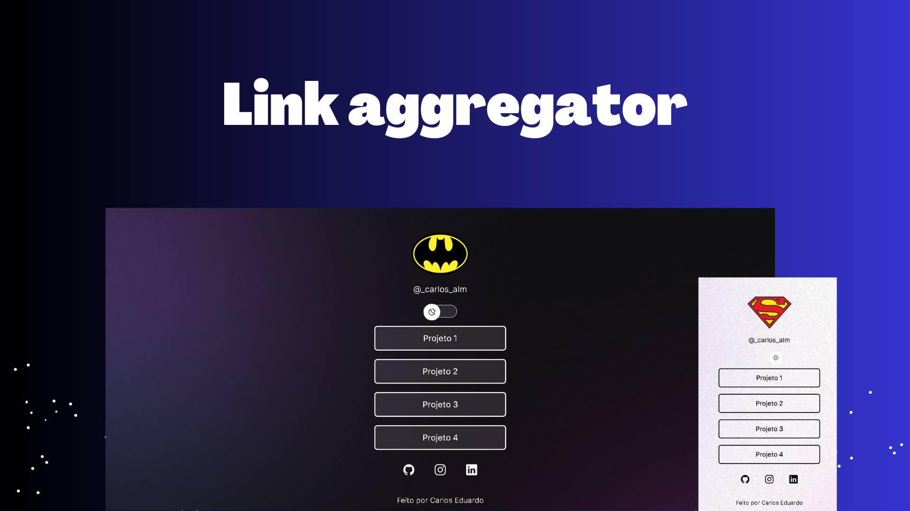

<h1 align="center"> Link Aggregator </h1>

Customized Program based on Rocketseat's "Discover" Project for learning WEB technologies  

  <a href="#-tecnologias">Technologies</a>&nbsp;&nbsp;&nbsp;|&nbsp;&nbsp;&nbsp;
  <a href="#-projeto">Project</a>&nbsp;&nbsp;&nbsp;|&nbsp;&nbsp;&nbsp;
  <a href="#-layout">Layout</a>&nbsp;&nbsp;&nbsp;|&nbsp;&nbsp;&nbsp;
  <a href="#memo-licença">Licença</a>

  

 

  

## 🚀 Technologies

This project was been developed with the following technologies:

- HTML and CSS
- JavaScript
- Git and Github
- Figma and Canvas

## 💻 Project

That project is an link aggregator that can be used as a business card online. it has built-in social media buttons, directional buttons for links and switch button for night mode and light mode.

- [Acesse o projeto finalizado, online](https://github.com/Carlos-EduardoAlmeida/Project.Discover-Rocketseat)

---

Feito por Carlos Eduardo De Almeida Silva